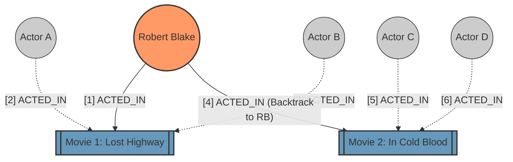

# Graph Traversal in Neo4j: Capturing Nodes and Relationships

When running Cypher queries, you often want to see not just the properties of the nodes you land on, but the actual **Nodes**, **Relationships**, and the **Path** the database took to get there.

## How to Return Traversed Nodes and Relationships

Given your initial query:
```cypher
MATCH (p:Person {name: 'Robert Blake'})-[:ACTED_IN]->(m:Movie)
MATCH (allActors:Person)-[:ACTED_IN]->(m)
RETURN m.title, collect(allActors.name)
```

Here are the two recommended ways to capture the graph structure traversed:

### Approach 1: Variable Binding (Recommended for Application Code)
Assign variables to the relationships inside the brackets `[r:TYPE]`. Because a movie has multiple actors, you must `collect()` the nodes and relationships from the second `MATCH`.

```cypher
MATCH (p:Person {name: 'Robert Blake'})-[r1:ACTED_IN]->(m:Movie)
MATCH (allActors:Person)-[r2:ACTED_IN]->(m)
RETURN m.title, 
       p AS robertBlakeNode, 
       r1 AS robertActedInRel, 
       collect(allActors) AS coActorNodes, 
       collect(r2) AS coActorRels
```

### Approach 2: Path Variables (Great for Graph Algorithms & Debugging)
Assign the entire pattern to a path variable to keep the ordered sequence of traversal intact.

```cypher
MATCH path1 = (p:Person {name: 'Robert Blake'})-[:ACTED_IN]->(m:Movie)
MATCH path2 = (allActors:Person)-[:ACTED_IN]->(m)
RETURN m.title, 
       nodes(path1) AS firstTraversalNodes, 
       relationships(path1) AS firstTraversalRels,
       collect(nodes(path2)) AS secondTraversalNodesList
```

---

## Understanding Cypher's Traversal (Depth-First Search)

Under the hood, Neo4j's Cypher execution engine primarily uses a **Depth-First Search (DFS)** strategy for pattern matching. When you chain `MATCH` clauses, you are instructing the engine on how deep to go down a specific path before backtracking.

### Step-by-Step DFS Execution of Your Query

1. **Anchor Node Selection:** The engine uses an index to find the starting node `(p:Person {name: 'Robert Blake'})`.
2. **First Depth Expansion:** It traverses the first `ACTED_IN` relationship to find the first Movie (e.g., *Lost Highway*).
3. **Second Depth Expansion:** From *Lost Highway*, it goes deeper, traversing all incoming `ACTED_IN` relationships to find every actor in that movie.
4. **Backtracking:** Once all actors for *Lost Highway* are collected, it backtracks to the anchor node ('Robert Blake').
5. **Next Depth Expansion:** It traverses to Robert Blake's next movie (e.g., *In Cold Blood*) and repeats step 3.

### Conceptualizing the DFS Traversal

Here is a visual representation of how Neo4j traverses this graph using DFS. Follow the numbers `[1]`, `[2]`, etc., to see the path the engine takes.



### Recommendations & Graph Algorithm Context

1. **Execution Plans (`EXPLAIN` / `PROFILE`):** 
   Always prepend your query with `PROFILE` in the Neo4j Browser to see the exact DFS traversal plan. Look for operations like `Expand(All)` which denote where the graph is expanding its depth.
   ```cypher
   PROFILE MATCH (p:Person {name: 'Robert Blake'})...
   ```
2. **Graph Algorithms (GDS):** 
   If you ever need to strictly enforce a Breadth-First Search (BFS) or calculate shortest paths, do not rely on standard Cypher `MATCH` patterns. Instead, use Neo4j's Graph Data Science (GDS) library or specialized pathfinding functions like `shortestPath()`, which are optimized differently than the standard DFS pattern matcher.
3. **Visualizing the Paths:**
   In Neo4j Browser, returning the nodes and relationships directly (Approach 1) will trigger the visual graph UI. This is the best way to manually verify that your query is traversing the relationships you expect.

---

## 3 Core Traversal Concepts

### 1. Counting Relationships (The `size()` vs `count()` rule)
Depending on what you need, there are different ways to count relationships (`r`) in Neo4j:

- **Standard Counting:** Use `count(r)` when doing a standard `MATCH`.
- **Counting from Collections:** Use `size(collect(r))` if you have already aggregated relationships into a list.
- **The O(1) Pro Trick (Fastest Degree Counting):** If you only need to know *how many* relationships a node has without knowing who is on the other end, **do not use `MATCH`**. Query the node's degree metadata directly:
  ```cypher
  MATCH (p:Person {name: 'Robert Blake'})
  RETURN p.name, size((p)-[:ACTED_IN]->()) AS numberOfMovies
  ```

### 2. Relationship Isomorphism (Preventing Duplicates)
By default, Cypher will **never traverse the exact same relationship twice within a single `MATCH` clause**. 

If you use **multiple `MATCH` clauses**, the rule resets, which can result in duplicate node visits:
```cypher
// ⚠️ WARNING: 'allActors' WILL include Robert Blake!
MATCH (p:Person {name: 'Robert Blake'})-[:ACTED_IN]->(m:Movie)
MATCH (allActors:Person)-[r2:ACTED_IN]->(m) 
```

**The Fix:** Combine into a single `MATCH` path to enforce Isomorphism (or use a `WHERE` filter):
```cypher
// ✅ SUCCESS: Cypher cannot use the ACTED_IN rel twice, so Robert Blake is excluded!
MATCH (p:Person {name: 'Robert Blake'})-[r1:ACTED_IN]->(m:Movie)<-[r2:ACTED_IN]-(coActors:Person)
```

### 3. Variable-Length Traversal
You can traverse paths of unknown depth (e.g., "friends of friends of friends") by adding an asterisk `*` inside the relationship brackets, optionally followed by boundaries (`*min..max`).

```cypher
// Between 1 and 3 hops
MATCH (p:Person {name: 'Robert Blake'})-[:ACTED_IN*1..3]->(m)
```

**Finding the "Kevin Bacon Number"**
For unknown chains where relationship directions change (e.g., Actor -> Movie <- Actor), omit the relationship type and rely on the `shortestPath` function to prevent unbounded traversal explosions:
```cypher
MATCH path = shortestPath(
  (p1:Person {name: 'Robert Blake'})-[*1..6]-(p2:Person {name: 'Kevin Bacon'})
)
RETURN path
```

**How Variable Hops Actually Work:**
When you specify `*1..3`, Neo4j evaluates paths at length 1, length 2, and length 3.
- Length 1: `(A)-[r1]->(B)`
- Length 2: `(A)-[r1]->(X)-[r2]->(B)`
- Length 3: `(A)-[r1]->(X)-[r2]->(Y)-[r3]->(B)`
It returns *all* valid paths that fit within these hop boundaries. If you only return the end node `(m)`, you might get duplicates if there are multiple paths to the same node, which is why `WITH` or `RETURN DISTINCT` is useful.

---

## 4. Chaining Queries with `WITH`

The `WITH` clause is the "glue" of complex Cypher queries. It acts like a pipe (`|`) in Unix. It takes the results from the previous `MATCH`, allows you to filter, aggregate, or sort them, and passes the refined results to the next part of the query.

### Why use `WITH`?
1. **Aggregating before matching more:** 
   Suppose you want to find actors who have been in more than 3 movies, and *then* find their co-actors.
   ```cypher
   MATCH (p:Person)-[:ACTED_IN]->(m:Movie)
   WITH p, count(m) AS movieCount
   WHERE movieCount > 3
   MATCH (p)-[:ACTED_IN]->()<-[:ACTED_IN]-(coActor:Person)
   RETURN p.name, coActor.name
   ```
2. **Limiting intermediate results:**
   If you want to find Robert Blake's 5 most recent movies, and then find the directors of *only* those 5 movies:
   ```cypher
   MATCH (p:Person {name: 'Robert Blake'})-[r:ACTED_IN]->(m:Movie)
   WITH m ORDER BY m.released DESC LIMIT 5
   MATCH (m)<-[:DIRECTED]-(d:Person)
   RETURN m.title, d.name
   ```

---

## 5. Query Parameters (Best Practice)

Up until now, we've hardcoded `'Robert Blake'` into our queries. In a real application, you should **never** hardcode values. Instead, you use **Parameters** (denoted by a `$` symbol).

### Why use Parameters?
- **Performance:** Neo4j caches the execution plan of a query. `MATCH (p:Person {name: 'Robert'})` and `MATCH (p:Person {name: 'Kevin'})` are treated as two entirely different queries. But `MATCH (p:Person {name: $actorName})` is compiled once and reused instantly.
- **Security:** It prevents Cypher Injection attacks.

### How it looks:
```cypher
// Instead of this:
MATCH (p:Person {name: 'Robert Blake'})-[:ACTED_IN]->(m:Movie)

// You write this:
MATCH (p:Person {name: $actorName})-[:ACTED_IN]->(m:Movie)
```

*Note: If you are testing in the Neo4j Desktop/Browser, you can declare a parameter before running your query by typing:*
`:param actorName => 'Robert Blake'`

---

## 6. Practice Exercises

Here are some practice queries to solidify your understanding of `WITH`, Parameters, and Variable-Length Traversals. Try writing them yourself before looking at the solutions!

### Exercise 1: The Basics of `WITH`
**Task:** Find 'Tom Hanks', get all his movies, but ONLY return the one with the highest revenue.
*Clue:* Use `WITH` to pass the variables you need to the `RETURN` clause, while applying an `ORDER BY` and `LIMIT`.

**Solution:**
```cypher
WITH 'Tom Hanks' AS theActor
MATCH (p:Person)-[:ACTED_IN]->(m:Movie)
WHERE p.name = theActor AND m.revenue IS NOT NULL
WITH theActor, m ORDER BY m.revenue DESC LIMIT 1
RETURN theActor, m.title AS title, m.revenue AS revenue
```

### Exercise 2: The Network Degree (Combining Concepts)
**Task:** Write a query that does the following:
1. Uses a parameter `$actorName` instead of hardcoding a name.
2. Finds all `Person` nodes connected to them through `ACTED_IN` relationships up to **2 hops away** (e.g., co-actors, or co-actors of co-actors). 
3. Uses `WITH` to pass only the `DISTINCT` connected people (let's call the variable `network`) to remove duplicates.
4. Uses the fast O(1) `size()` trick to return the `network.name` AND the total number of movies that person has acted in.

**Solution:**
```cypher
MATCH (p:Person {name: $actorName})-[:ACTED_IN*1..2]-(network:Person)
WITH DISTINCT network
RETURN network.name, size((network)-[:ACTED_IN]->()) AS totalMovies
```